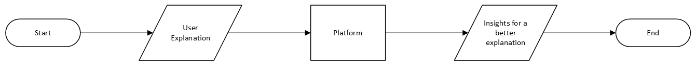
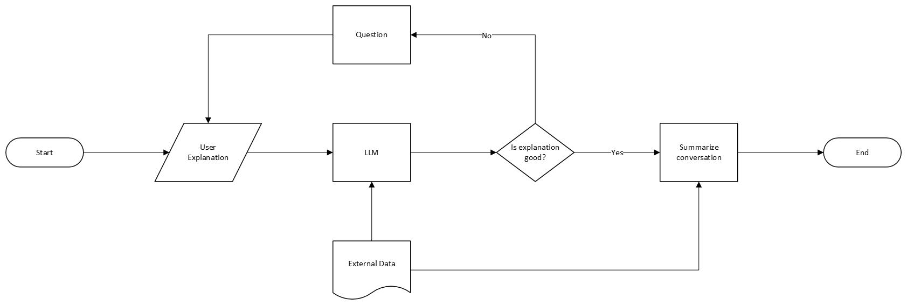

In this highest-level view, we have the Explanation from the user as the Input. It passes through the “AI-powered Platform” and then the "Platform" outputs the insights on how to improve the explanation to make it more comprehensive. The “Platform" is depicted as a rectangular box which is often used to describe process.

In this second diagram, we explore the process of how the "Platform" generates the explanation insights. First the User Explanantion and an External Document are inputted into the "Platform" (a.k.a the LLM). Then, the LLM will tell if the explanation provided is good or not. If the explanation is not good, the LLM will respond with a "No" and will ask the user some questions for clarification. The user will have to provide a better explanation. If the explanation is considered good, the LLM will respond affirmatively and will conclude the conversation by summarizing it.

