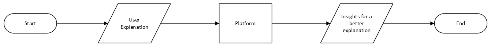
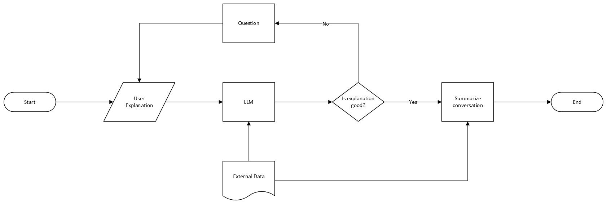
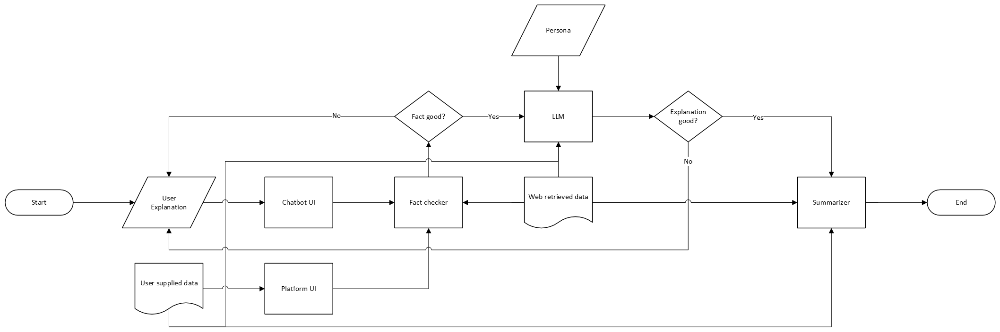

# D0

In this highest-level view, we have the Explanation from the user as the Input. It passes through the “AI-powered Platform” and then the "Platform" outputs the insights on how to improve the explanation to make it more comprehensive. The “Platform" is depicted as a rectangular box which is often used to describe process.

# D1

In this second diagram, we explore the process of how the "Platform" generates the explanation insights. First the User Explanantion and an External Document are inputted into the "Platform" (a.k.a the LLM). Then, the LLM will tell if the explanation provided is good or not. If the explanation is not good, the LLM will respond with a "No" and will ask the user some questions for clarification. The user will have to provide a better explanation. If the explanation is considered good, the LLM will respond affirmatively and will conclude the conversation by summarizing it.

# D2

In this diagram, note that we have four kinds of inputs: the user's explanation of a topic, user supplied data about that topic (like notes taken), the web retrieved topic, as well as the LLM's persona. Persona are things that make the LLM core process information a certain way, and might require the user to phrase their explanation about a topic in such a way that would satisfy the LLM. The user can supply their own data through a UI in the platform, and the user can engage with the LLM through a chatbot interface.

Because LLMs are bad at fact checking, we will add a fact-checker section in the platform that uses user supplied data and web retrieved data to ground the user explanation to be truthful. If it isn't truthful, the user will be notified and asked to provide another explanation. If the explanation is determined to be truthful, the content will then be passed into an LLM, modified with a persona and supplied with previously mentioned data about the topic. The LLM will then process the data and determine whether the explanation is good. If not, the LLM will ask pointed questions to the user in an attempt to understand the topic more. If the explanation is good, the process then move on to the summarizer step, where the whole conversation is condensed for later use.

